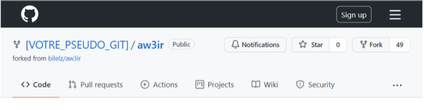
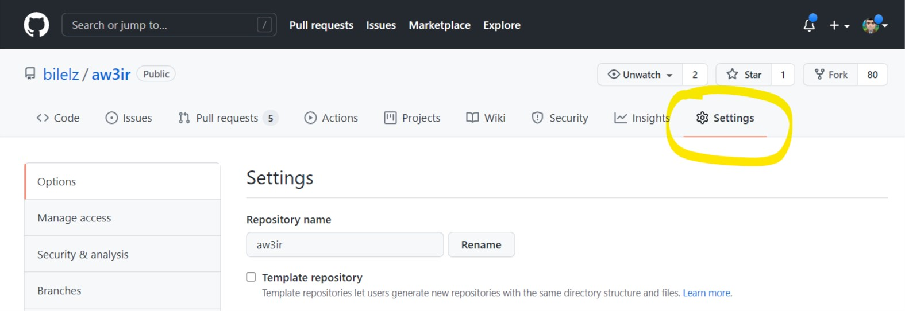
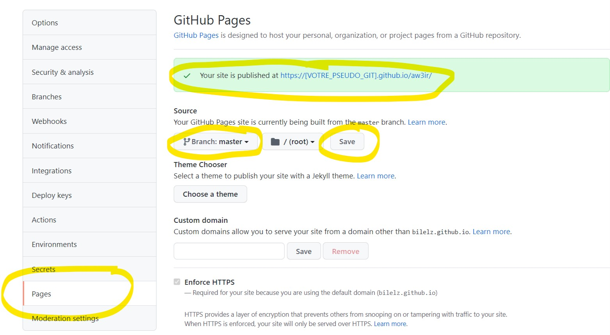
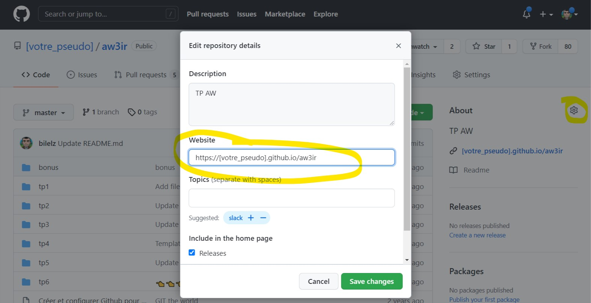
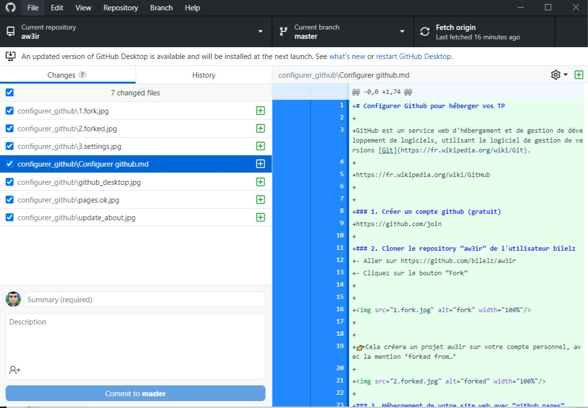
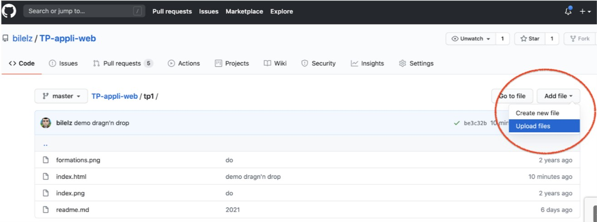
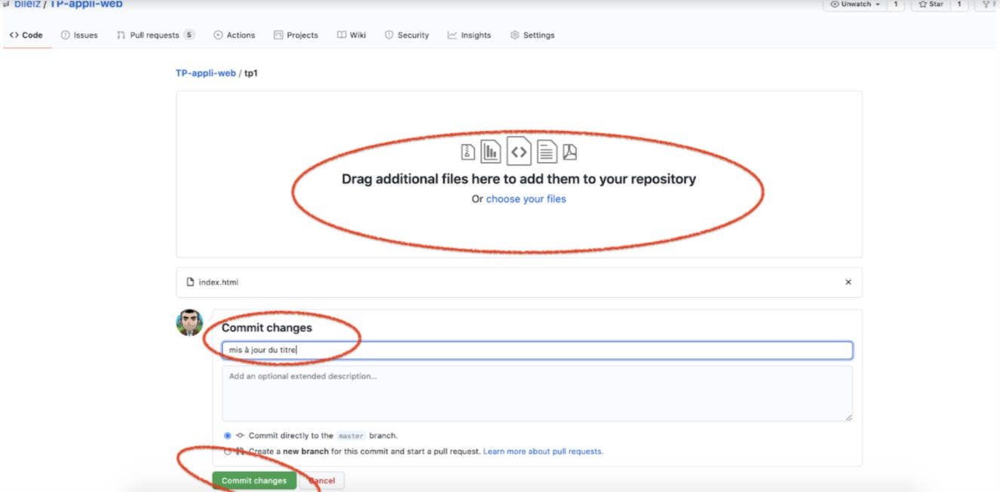
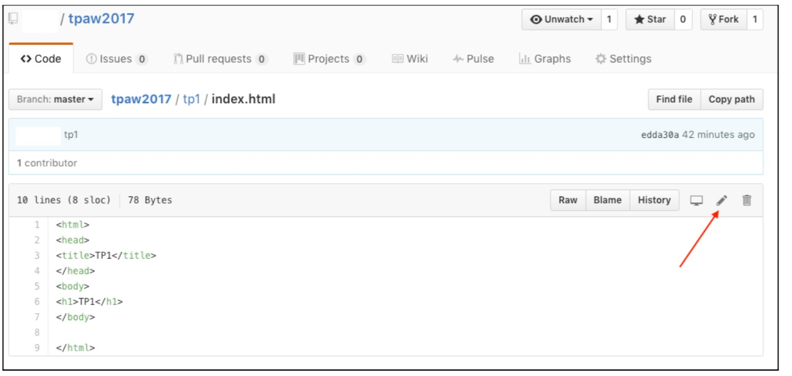

# Configurer Github pour héberger vos TP

GitHub est un service web d'hébergement et de gestion de développement de logiciels, utilisant le logiciel de gestion de versions [Git](https://fr.wikipedia.org/wiki/Git).

https://fr.wikipedia.org/wiki/GitHub

- [Configurer Github pour héberger vos TP](#configurer-github-pour-héberger-vos-tp)
    - [1. Créer un compte github (gratuit)](#1-créer-un-compte-github-gratuit)
    - [2. Cloner le repository “aw3ir” de l'utilisateur bilelz](#2-cloner-le-repository-aw3ir-de-lutilisateur-bilelz)
    - [3. Hébergement de votre site web avec “github pages”](#3-hébergement-de-votre-site-web-avec-github-pages)
    - [4. Mettre à jour la description de votre dépot git avec l'URL de votre site web](#4-mettre-à-jour-la-description-de-votre-dépot-git-avec-lurl-de-votre-site-web)
- [Upload de vos codes sources vers Github](#upload-de-vos-codes-sources-vers-github)
  - [Méthode 1: Avec Github Desktop (recommandé pour les débutants)](#méthode-1-avec-github-desktop-recommandé-pour-les-débutants)
  - [Methode 2 : Directement depuis le site web github](#methode-2--directement-depuis-le-site-web-github)
    - [*Uploader* des fichiers](#uploader-des-fichiers)
    - [Modifier directement un fichier](#modifier-directement-un-fichier)

### 1. Créer un compte github (gratuit)
https://github.com/join

### 2. Cloner le repository “aw3ir” de l'utilisateur bilelz
- Aller sur https://github.com/bilelz/aw3ir
- Cliquez sur le bouton “Fork”

👉Cela créera un projet aw3ir sur votre compte personnel, avec la mention ‘forked from…’

### 3. Hébergement de votre site web avec “github pages”

Pour rendre notre code source accessible depuis une page web, nous allons utiliser une option Github sui est *Github pages* (https://pages.github.com).

Github pages va utiliser vos pages web qui sont dans votre reposity **aw3ir** et les rendre accéssible sur une URL : **https://[votre_pseudo_git].github.io/aw3ir**

 - Aller dans les paramètres de votre projet aw3ir, puis dans la section "Pages" 

 - Descendre dans la page vers la section Github Pages
 - Selectionnez “master branch” 
 - et cliquez sur le bouton “Save”

 - Github vous aura créer un site web Github pages va utiliser vos pages web qui sont dans votre reposity **aw3ir** et les rendre accéssible sur une URL : **https://[votre_pseudo_git].github.io/aw3ir**

### 4. Mettre à jour la description de votre dépot git avec l'URL de votre site web
 - Retourner sur l’onglet “Code” et cliquez sur l'icone ⚙ pour y ajouter l’URL de votre site

https://votre_pseudo.github.io/aw3ir

# Upload de vos codes sources vers Github

## Méthode 1: Avec Github Desktop (recommandé pour les débutants)

- Installer https://desktop.github.com/ sur votre poste personnel

Sur votre page github du projet “aw3ir”, 
- cliquer sur le bouton “Clone or download”, 
- puis sur Open in Desktop

Cela va ouvrir *Github Desktop* et vous demander de choisir un répertoire pour le cloner.

Une fois fait, vous pourrez modifier (dans un éditeur de texte, visual studio code ou autre) les fichiers directement depuis votre ordinateur.

Après chaque modification, vous pouvez les envoyer sur votre répertoire distant Github.com

Github Desktop détecte automatiquement toutes les modifications

- Mettre un commentaire dans le champ “Summary”
- Cliquer sur “Commit”, cela enregistrera les modifications sur votre Git local

Pour envoyer les modifications sur le Git distant : 
- Cliquer sur “Push origin” (en haut à droite)

Une fois terminé, les mises à jour seront visibles d’ici quelques minutes sur votre site **https://votre_pseudo.github.io/aw3ir**

## Methode 2 : Directement depuis le site web github

### *Uploader* des fichiers
Pour créer ou envoyer des fichiers sur Github, vous pouvez utiliser la barre d’action.
Visible dans chaque dossier du projet : 

Vous pouvez uploader 
- En cliquant sur “Choose your files” ou en faisant un drag’n drop (glisser/déposer)
- Saisir un commentaire
- cliquez sur “Commit changes”

### Modifier directement un fichier
Pour modifier un fichier, aller sur ce fichier et cliquez sur l'icône en forme de stylo:

Vos modifications seront visibles au bout de quelques minutes environ sur votre site **https://votre_pseudo.github.io/TP-appli-web**

Exemple avec : https://bilelz.github.io/aw3ir/
